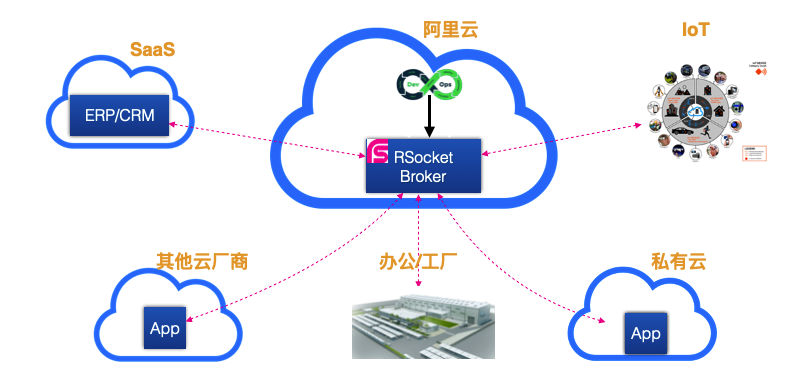

启动RSocket Broker非常简单，但是考虑开发的流畅性，我们推出了一个免费的Alibaba RSocket Broker提供给大家测试使用，请注意，是测试，不是产品环境。 :) 

使用非常简单，首先我们将rsocket.brokers调整为线上服务列表，如下

```properties title="src/main/resources/application.properties"
rsocket.brokers=tcp://139.196.223.16:9999,tcp://139.196.223.138:9999
```

接下来我们执行一下 `curl https://jwt.alibroker.info` 获取对应的JWT token，然后设置为rsocket.jwt-token的属性值，如下：

```properties title="src/main/resources/application.properties"
rsocket.jwt-token=xxx
```

最后启动你的RSocket应用进行测试就可以。 详细的样例，你可以参考： https://github.com/alibaba-rsocket-broker/rsocket-broker-simple-example

# Cloud RSocket Broker的优点

* 快捷启动应用，不需要本地启动一个RSocket Broker才能测试
* 租户级别的安全隔离：只有JWT token相同的应用之间才能通讯，后续还会加强安全建设
* 混合云体验： 你的应用同时部署在阿里云、腾讯云，还有一些在私有机房，都没有问题，只要连接到Cloud RSocket Broker上就可以互通，无需任何设置

借助于RSocket Cloud Broker，下图架构完全没有问题，你可以马上使用免费的RSocket Broker测试起来。




