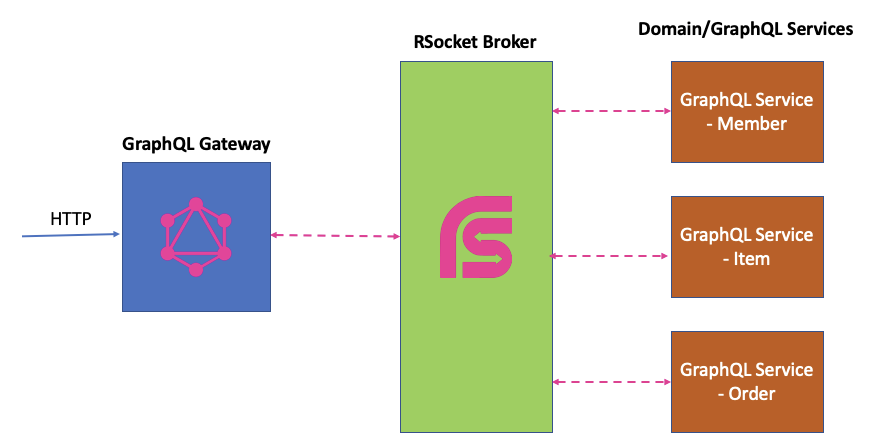

GraphQL在数据查询领域扮演者非常重要的角色，个人觉得GraphQL、OpenAPI和AsyncAPI这三者相辅相成，都是服务自描述，不需要单独的文档说明；包括完成的Schema，如数据类型等； 完备的元数据支持等。

GraphQL服务主要是基于HTTP通讯，如query, mutation基于HTTP GET和POST，subscription则基于WebSocket。 这篇文章我们主要是讨论如何基于RSocket来实现GraphQL远程服务。 为何要选择RSocket来实现GraphQL通讯，原因如下：

* 异步化：GraphQL会从多个数据源获取数据，对比HTTP REST API设计，GraphQL涉及的数据更多一些，通常还不能很好地利用Cache，所以GraphQL的查询响应时间可能比较长。 如果是同步的话，那么I/O阻塞就非常严重，如果是异步化的化，就可以很好地解决这个问题。
* 通讯模型匹配： GraphQL的query/mutation对应RSocket的request/response，GraphQL的subscription则对应RSocket的request/stream，可以说完全没有违和感。
* RSocket的性能好： 这个就不解释啦 :)

# GraphQL RSocket的架构

在RSocket的架构中，通常都会选择基于RSocket Broker设计方案，也就是由RSocket Broker程度着通讯双方流量转发的角色，所以我们会基于RSocket Broker说明。

### DataFetcher 和 Domain服务通讯

我们只需要构建一个GraphQL Server，如你可以选择graphql-java-spring-boot-starter-webflux，注意要选择WebFlux :)

```xml

<dependency>
    <groupId>com.graphql-java</groupId>
    <artifactId>graphql-java-spring-boot-starter-webflux</artifactId>
    <version>2.0</version>
</dependency>
```

稍微说明一下：graphql-java-spring-boot-starter-webflux会调用 `graphQL.executeAsync(executionInput)` 进行GraphQL异步化的操作，所以刚好和WebFlux无缝对接。

接下来就是让GraphQL的DataFetcher和Rsocket Broker通讯，调用各种RSocket Domain Service，获取对应的数据。 由于RSocket Broker管理着众多的服务，所有RSocket Broker管理的服务都可以被DataFetcher调用，可以说非常方便，架构如下：


DataFetcher异步化： 这里我选择的是graphql-java，而DataFetcher的泛型是支持CompletableFuture，而Java Reactive框架都支持和CompletableFuture转换的，看一下样例代码：

```java
public DataFetcher<CompletableFuture<Map<String, Object>>> bookById() {
        return dataFetchingEnvironment -> {
            String bookId = dataFetchingEnvironment.getArgument("id");
            return Flux.fromIterable(BOOKS)
                    .filter(book -> book.get("id").equals(bookId))
                    .next()
                    .toFuture();
        };
    }
```

即便不是GraphQL RSocket方案，如果你做GraphQL异步化时，也要利用好CompletableFuture特性，可以方便你和各种Reactive框架对接，包含异步RPC，R2DBC等。

### 分布式的GraphQL

GraphQL其实并不特别复杂，JS/TS对GraphQL的支持不用说啦，我这里以graphql-java为例，我会实现领域服务的同时，也会对外提供GraphQL服务，主要是GraphQL的DataFetcher对接数据库、NoSQL等就非常很多，也发布我们构建相对复杂的查询。 在Domain服务和GraphQL服务合二为一的架构下，下图结构可能就方便 一些：



在上述的架构设计中，GraphQL Service有不同的系统自行考虑，这个时候就会出现多个不同的GraphQL Service，所以你需要了解你要查询的GraphQL Service是什么。 这里我们介入一个namespace的感念，其实就是GraphQL的服务名称，一来方便RSocket Broker的路由，而来方便定位GraphQL Service。 所以在GraphQL
Gateway上，你要访问的GraphQL服务的HTTP URL则如下：

```
http://localhost:8383/com.alibaba.rsocket.graphql.book.BookGraphqlService/graphql
```

你不用太担心，RSocket Broker包含所有的信息GraphQL服务的元信息，通过GraphQL Introspection，你是可以发现整个集群的所有GraphQL Schema信息，方便你构建GraphQL服务查询系统。

# 我该选择哪个方案？

个人觉得方案2更合适点，主要是GraphQL Service和domain Service是在一起的，都是一拨人开发的，他们对需求的把握的非常好，而且GraphQL Schema设计可能更合理一些。

方案1主要是用在GraphQL对接上，如公司内部并没有GraphQL需求，都是在使用OpenAPI和RPC，但是合作伙伴可能希望使用GraphQL，主要是对应的业务场景更合适，所以这个时候增加一个GraphQL Gateway来对接目前的RSocket服务、OpenAPI或RPC等，可能比较简单一些。

# GraphQL RSocket Client

前面说到，GraphQL和RSocket的配合比较好，如果我不选择HTTP通讯方案，而选择RSocket通讯协议，那我们应该如何做？ 其实非常简单，给出一个样例的GraphqlRSocketClient样例代码：

```java
public interface GraphqlRSocketClient {

    Mono<ByteBuf> query(String query, Map<String, Object> variables);

    Mono<ByteBuf> mutation(String mutation, Map<String, Object> variables);

    Flux<ByteBuf> subscription(String subscription, Map<String, Object> variables);
}
```

当然在构建GraphqlRSocketClient我们会接入GraphQL服务的namespace作为RSocket的路由信息，接下来就是和RSocket Broker通讯，这个实现还是非常简单的。在代码样例中，也会包含对应的代码。

# 总结

RSocket GraphQL Gateway样例代码： https://github.com/alibaba-rsocket-broker/rsocket-graphql-gateway

