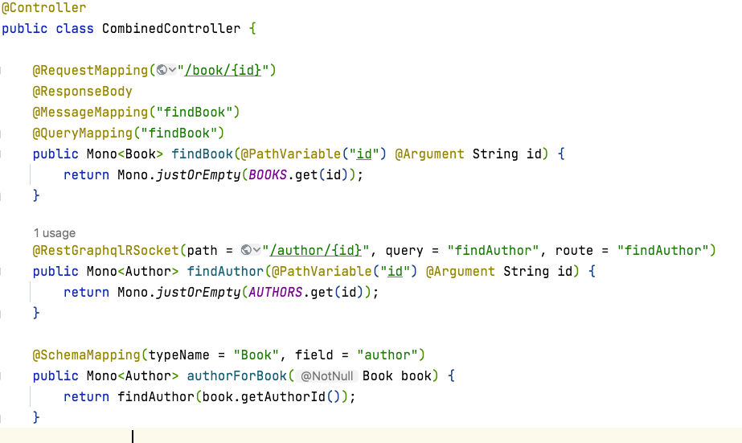

在当前的架构设计和开发中，HTTP REST API还是扮演着重要的角色，但是GraphQL和RSocket对比HTTP REST提供更丰富的特性和更高的性能。
如果能在当前的架构设计中能透明增加GraphQL和RSocket支持将是非常好的事情。

现在你只需为HTTP REST Controller添加几个Annotation，就可以同时支持HTTP REST， GraphQL和RSocket三者。 高效通讯的走RSocket，数据聚合的走GraphQL，传统的走HTTP REST。




当然你也可以选择GraphQL over RSocket，你只需要添加以下代码即可： 

```java
    @Autowired
    private GraphQlService graphQlService;
    
    @MessageMapping("graphql")
    public Mono<Map<String, Object>> graphql(Map<String, Object> input) {
        final RequestInput requestInput = new RequestInput((String) input.get("query"),
                (String) input.get("operationName"),
                (Map<String, Object>) input.get("variables"));
        return graphQlService.execute(requestInput)
                .map(ExecutionResult::toSpecification);
    }
```

如果你对该方案有兴趣，可以参考Demo样例： https://github.com/linux-china/rest-graphql-rsocket-demo

# 参考

* Spring GraphQL: https://github.com/spring-projects/spring-graphql
