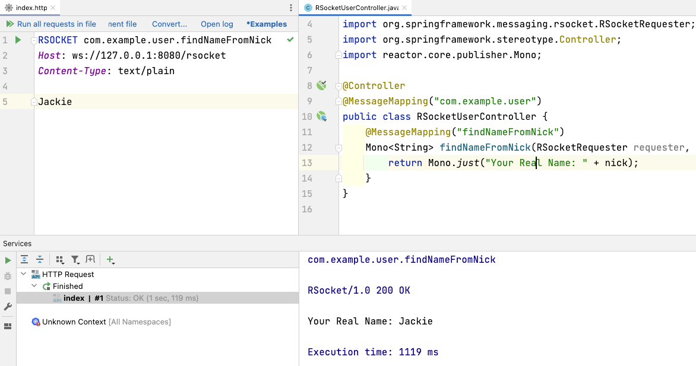

RSocket JetBrains plugin主要是方便开发者在JetBrains IDE中对RSocket服务进行测试，截屏如下： 



目前插件主要支持以下特性： 

* 通讯模型支持持: request/response, fireAndForget, request/Stream, metadataPush
* 传输层支持:  TCP 和 WebSocket
* Live templates: rpc, fnf, stream, metadata
* 支持Spring Boot RSocket, Alibaba/Spring RSocket Broker: 支持Alibaba RSocket Broker上注册的服务测试
* Code completion for RSocket headers
* Intention action to convert RSocket request to rsc CLI

如果测试Alibaba RSocket Broker上的服务的话，请添加 `X-AliBroker: true` 请求头即可，如下： 

```
RSOCKET com.alibaba.user.UserService.findById
X-AliBroker: true
Host: 127.0.0.1:9999
Content-Type: application/json

[1]
```

更多的介绍请访问： https://plugins.jetbrains.com/plugin/18195-rsocket-requests-in-http-client
