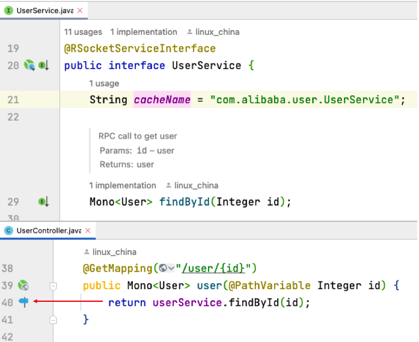

距离1.1.2的发布已经过去有4个月啦，有大量的开发包在此阶段进行了更新，RSocket Java SDK发布了1.1.2版本，另外出于安全的考虑， 也需要对一下依赖进行更新。 

### 依赖更新

* Spring Boot 2.6.6: 修复 CVE-2022-22965 漏洞，请参考 https://spring.io/blog/2022/03/31/spring-framework-rce-early-announcement
* RSocket 1.1.2
* Vaadin 23.0
* Eclipse Collections 11.0
* Other dependencies update

### 特性调整

* Java 11 for RSocket Broker: Vaadin 23已经不在支持Java 8，所以我们将RSocket Broker升级到Java 11，但是不用担心，alibaba-rsocket-broker对应的开发包基于Java 8的
* RSocket Broker Server瘦身: 从1.1.2版本的108M降低到1.1.3版本的71M
* RxJava 3.1.x兼容: [RxJava 3.1.1版本](https://github.com/ReactiveX/RxJava/releases/tag/v3.1.1) 将fusion相关的接口调整到`io.reactivex.rxjava3.operators` package下，这导致Reactor RxJava 3适配出现了不兼容的问题，alibaba-rsocket-core对rxjava3之前接口进行inline操作，使用RxJava 3的任何版本都不会收到影响

### 其他

* RSocket JetBrains插件: 你可以在JetBrains IDE中直接测试RSocket服务， 另外你也可以使用命令行进行测试，请参考 https://servicex.sh/docs/tutorial-basics/rsocket-testing
* Alibaba RSocket Broker JBang Catalog: 做一些RSocket Demo演示时，请不要忘记RSocket Broker的JBang支持 https://github.com/alibaba-rsocket-broker/jbang-catalog
* Docker image: https://hub.docker.com/r/linuxchina/alibaba-rsocket-broker
* Helm chart: https://artifacthub.io/packages/helm/alibaba-rsocket-broker/alibaba-rsocket-broker

### 乐趣

在alibaba-rsocket-service-common的1.1.3版本，增加了 @RSocketServiceInterface， 你可以将RSocket Service interface添加上该annotation，
这样在代码中调用RSocket Service interface的函数接口，IntelliJ IDEA就会将其标识为网络调用，这样方便你更好地了解你的代码，效果如下: 

**注意**: 你需要安装 [Microservices Annotator plugin](https://plugins.jetbrains.com/plugin/18361-microservices-annotator) 和 [RSocket plugin](https://plugins.jetbrains.com/plugin/18195-rsocket-requests-in-http-client)

