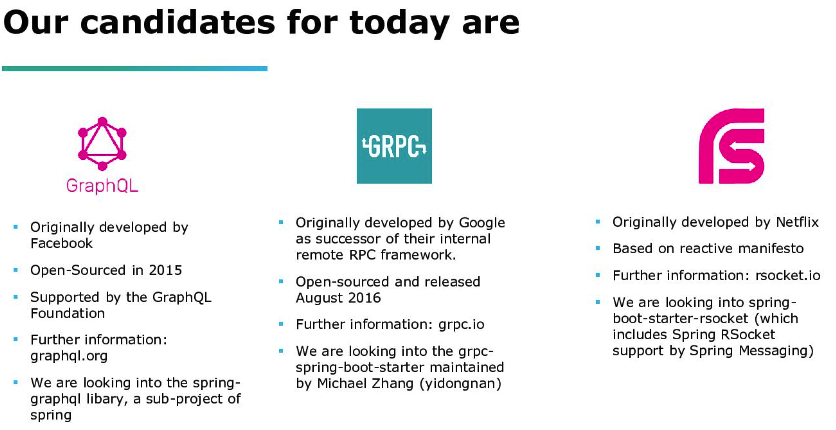
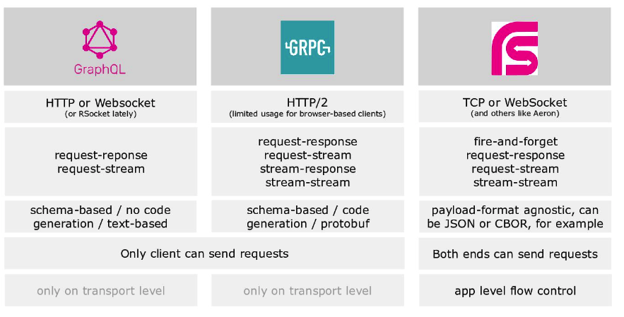

最近两篇非常不错的文章，这里贴一下：

### Istio, eBPF and RSocket Broker: A deep dive into service mesh
文章连接为： https://medium.com/geekculture/istio-ebpf-and-rsocket-broker-a-deep-dive-into-service-mesh-7ec4871d50bb
个人觉得介绍非常全面，将Istio, eBPF and RSocket Broker都进行了细致的分析，有做Service Mesh这方面工作的同学可以参考一下。 
关于Service Mesh和RSocket Broker的整合，可以参考RSocket By Example的Service Mesh介绍： https://rsocketbyexample.info/service-mesh/

### Beyond REST - An Overview about Modern API Technologies
是Spring IO 2022大会的一个Topic，演讲视频：https://www.youtube.com/watch?v=6mrLFcZhWjs  
对应的PPT连接为 https://speakerdeck.com/larsduelfer/beyond-rest-an-overview-about-modern-api-technologies

将其中的对比截屏一下： 

