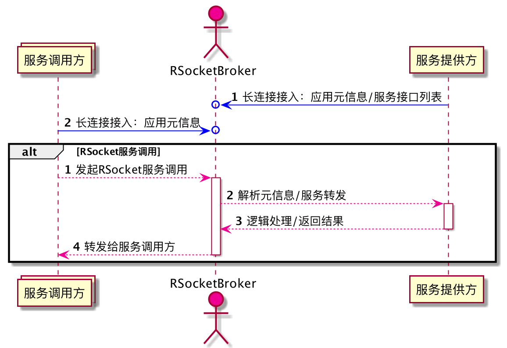

# 快速入门

这是一个最简单的RSocket Broker参考样例： 服务调用方(requester)向Broker发起服务调用请求，Broker将请求转发给服务提供者(Responder)， 最后Broker将Responder的处理结果再返回给requester。 流程图如下： 



**代码仓库地址**： https://github.com/alibaba-rsocket-broker/rsocket-broker-simple-example 你可以点击`Use this template`绿色按钮创建你自己的应用。

# 服务接口设计

RSocket的服务接口是基于Reactive语义的，你只需要将API的返回值设置为Mono和Flux就可以。 关于Mono和Flux的介绍，请参考 [Reactor Core Reference](https://projectreactor.io/docs/core/release/reference/)

```java
public interface UserService {

    Mono<User> findById(Integer id);
    
    Flux<User> findVipUser();

}
```

# 服务接口实现

服务接口的实现类就是一个简单的Spring Bean，我们只需要添加对应的@RSocketService Annotation标明该服务为RSocket服务即可。

```java
@Service
@RSocketService(serviceInterface = UserService.class)
public class UserServiceImpl implements UserService {
    private final Faker faker = new Faker();

    @Override
    public Mono<User> findById(Integer id) {
        return Mono.just(randomUser(id));
    }

    private User randomUser(@Nullable Integer id) {
        User user = new User();
        user.setId(id == null ? new Random().nextInt() : id);
        user.setNick(faker.name().name());
        user.setPhone(faker.phoneNumber().cellPhone());
        user.setEmail(faker.internet().emailAddress());
        return user;
    }

}
```

# user-service-spring-boot-starter

为了方便其他Spring Boot应用调用RSocket服务，我们这里创建一个服务对应的Spring Boot Starter。 创建一个Spring Configuration，来生成UserService调用的代理Bean，代码如下：

```java
@Configuration(proxyBeanMethods = false)
public class UserServicesAutoConfiguration {
    @Bean
    public UserService userService(UpstreamManager upstreamManager) {
        return RSocketRemoteServiceBuilder
                .client(UserService.class)
                .upstreamManager(upstreamManager)
                .build();
    }
}
```

# RSocket服务远程调用

在服务消费者方，只需要引入`user-service-spring-boot-starter`依赖，然后在Controller或者其他Bean中直接UserService对应的代理bean即可，如下：

```java
@RestController
@RequestMapping("/user")
public class UserController {
    @Autowired
    private UserService userService;

    @GetMapping("/{id}")
    public Mono<User> user(@PathVariable Integer id) {
        return userService.findById(id);
    }

}
```

# 测试

最后我们只需要在应用消费者端发起对应的请求就可以，如通过一个HTTP请求来触发对后端RSocket的服务调用：

```bash
curl http://localhost:8181/user/1
```
