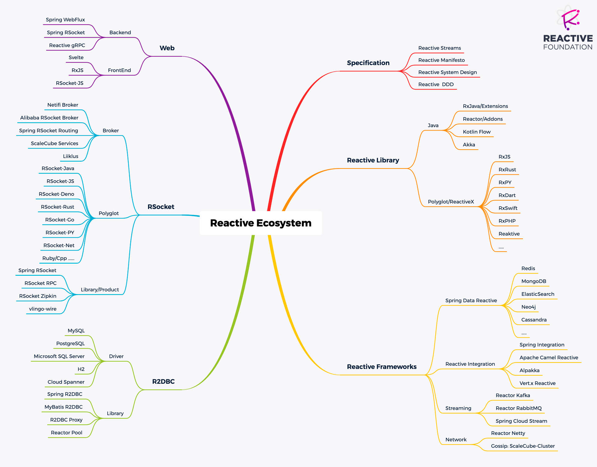

# 参考资料

Reactive/RSocket生态虽不是非常庞大，但是也是非常全面，这里我们提供一个大致的MindMap图方便你的参考： 

# 相关的链接 

* Reactive Foundation: https://www.reactive.foundation/
* 反应式宣言: https://www.reactivemanifesto.org/zh-CN  
* RSocket Github: https://github.com/rsocket
* Alibaba RSocket Broker的Wiki: https://github.com/alibaba/alibaba-rsocket-broker/wiki
* RSocket by Example: http://rsocketbyexample.info/
