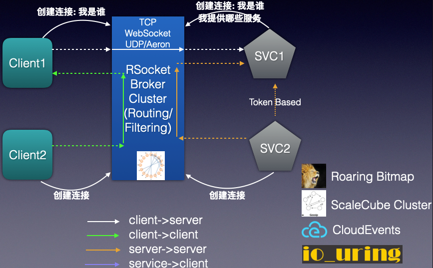

# RSocket Broker工作原理
RSocket除了支持多种通讯模型，此外还支持对等(Peer to Peer)通讯，也就是通讯的双方既可以是客户端也可以是服务端。让我们看一下RSocket Broker的架构：

在上图中，RSocket Broker启动后，监听特定的端口，如Alibaba RSocket Broker的RSocket监听端口为9999。 

* 当一个服务提供者应用启动后，主动和Broker创建一个TCP长连接，然后告诉Broker自己能提供的服务列表。 
* 当一个服务消费者应用启动后，也主动和Broker创建一个TCP长连接，当消费者应用要调用远程服务时，
* 服务消费者会将服务调用请求封装为消息(消息ID唯一)发给Broker，Broker在收到消息后，根据消息的元信息解析出要调用的服务，然后在内部的服务路由表中查找出能够提供这一服务的服务提供者， 然后将该请求通过服务提供者和Broker已经建立的长连接发送给服务提供者。
* 服务提供者在处理完请求后，将处理结果再次封装为消息(关联之前的消息ID)，回发送给Broker 
* Broker根据消息ID匹配，将返回的消息再转发服务调用方
* 服务调用方收到响应的消息，进行对应的业务处理

这种基于Broker的消息通讯方式，会有以下一些优点： 

* 无端口监听: 服务提供方不再监听端口，这个和HTTP REST API和gRPC是完全不同的，这样更安全
* 通讯透明： 调用方和服务提供者完全透明，不用感知对方的存在
* 流控： 如果服务提供者压力过大，则Broker根据反馈自动将消息转发给其他服务提供者，或者直接熔断，快速失败后返回给服务调用方
* 服务注册发现： 不需要传统的服务注册发现基础设施，如Eureka, Consul, ZooKeeper等，减少基础设施依赖成本
* 安全： Broker会对服务提供方和服务消费者进行接入权限验证，同时只需要Broker部署TLS支持就可以保证通讯通道安全
* 网络接入便捷： 由于是通讯双方都要接入到Broker上，所以对网络无任何要求，如办公网或私有云，也能为云上应用提供服务支持

当然Broker也有一些缺点，由于不是通讯双方之间通讯，多了Broker的转发，所以性能有一点下降。 
此外所有的通讯流量都有经过Broker转发，所以存在网络的一个瓶颈，但是这个可以通过集群和Broker的高可靠性进行保证。

