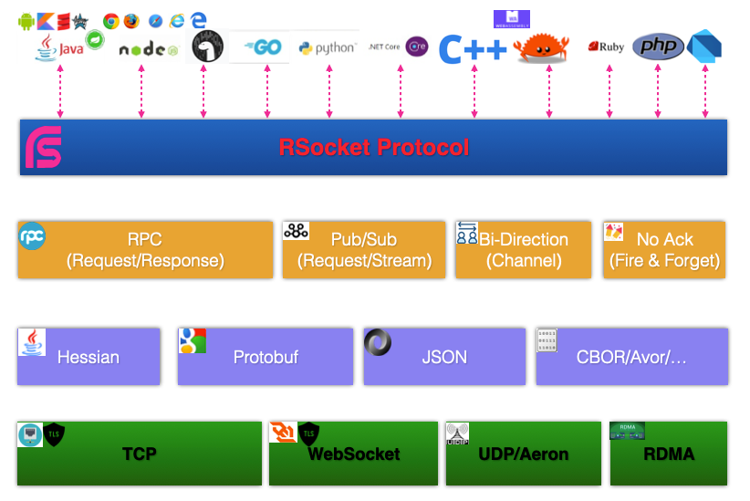

# RSocket介绍

RSocket是一个基于Reactive语义的异步化的、二进制、消息通讯协议，它属于应用层协议。

### RSocket四种通讯模型

* Request/Response: 这个主要是解决RPC通讯的场景，也就是常说的请求/响应模式
* Request/Stream: 该模型类似于Pub/Sub(发布/订阅)模式，可以请求流式数据
* Fire and Forget: 无需回执确认的数据发送，如日志传输、Metrics采集等，数据发出去后不需要回执确认，在一些非关键数据场景中使用，性能最高
* Channel: 双向流式通讯，类似于WebSocket，通讯的双方创建一个虚拟的通讯通道，然后在此通道中相互传输数据，如聊天、实时反馈系统等。

### MetadataPush: 元数据/事件广播

考虑运维维护的需要，RSocket还提供了一个metadataPush的通讯模型，虽然和Fire and Forget模型类似，但是出发点主要是解决通讯双方之间的元信息推送： 

* metadataPush：通讯的双方进行元信息推送或事件广播，如Broker架构设计中集群变更通知、应用上下线通知、配置推送等场景
* CloudEvents: CloudEvents是事件描述的规范，建议在使用medataPush推送信息时采用CloudEvents标准规范 https://cloudevents.io/

### 点对点通讯

Rsocket同时还支持P2P(Peer 2 Peer)通讯模型，也就是通讯的双方互为Client/Server，这个也是RSocket Broker设计的基础，可以做到无端口监听发布服务。 

### 其他特性: BackPress，Lease和Resume
此外RSocket还支持以下特性：

* BackPressure背压支持：可以防止突发流量下对消息处理造成巨大压力，导致服务不能响应
* Lease支持: 基于租期合约的通讯模型，可以根据消息数量和时间段两个维度制定租约，能很好的包含系统和细粒度的安全控制
* Resume支持：断点续传，通讯中断回复后，可以将此阶段的消息再次发送给请求方

# 多语言SDK

RSocket是标准的通讯协议，支持多个主流语言接入，对应的SDK和技术栈如下：

更多关于RSocket介绍，可以参考: https://rsocketbyexample.info/
